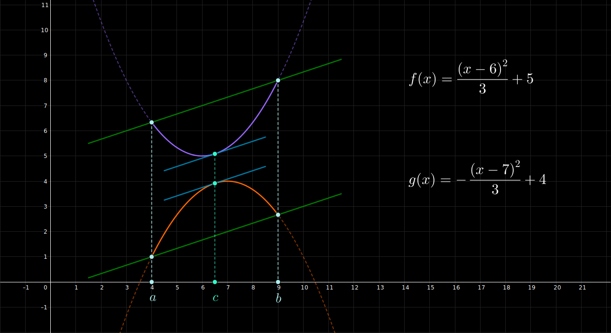

## Teorema de Cauchy - Ejemplo 2

 

$$
    \large{
        f(x) = \frac{(x - 6)^{2}}{3} + 5
    }
    \hspace{1em}
    \in [4, 9]
$$

 

$$
    \large{
        g(x) = -\frac{(x - 7)^{2}}{3} + 4
    }
    \hspace{1em}
    \in [4, 9]
$$

 

 

#### Links

- [Youtube](https://www.youtube.com/watch?v=wEQRuusSQu8)
- [Geogebra](https://www.geogebra.org/calculator/wppr6j5u)