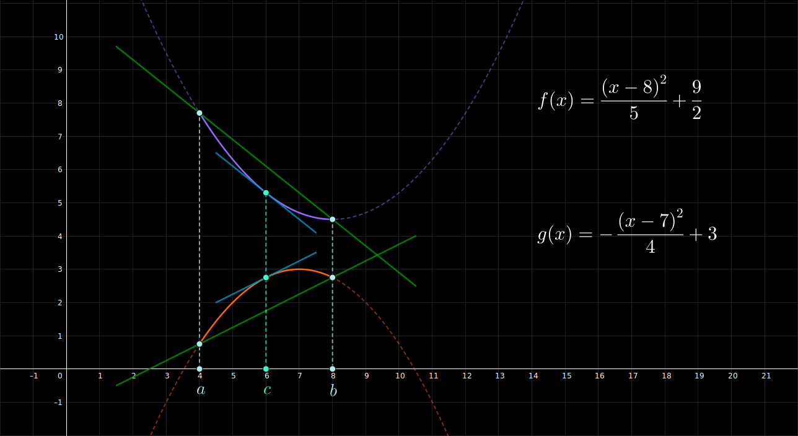

## Teorema de Cauchy - Ejemplo 3

 

$$
    \large{
        f(x) = \frac{(x-8)^{2}}{5} + \frac{9}{2}
    }
    \hspace{1em}
    \in [4, 8]
$$

 

$$
    \large{
        g(x) = -\frac{(x-7)^{2}}{4} + 3
    }
    \hspace{1em}
    \in [4, 8]
$$

 

 

#### Links

- [Youtube](https://www.youtube.com/watch?v=Lb9nFiYri6o)
- [Geogebra](https://www.geogebra.org/calculator/wxzwaeuz)