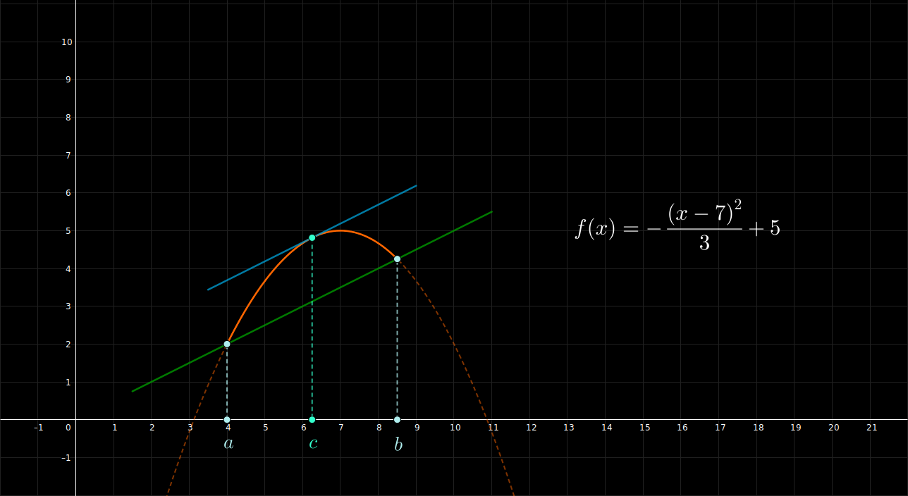

## Teorema de Lagrange - Ejemplo 1

 

$$
    \large{
        f(x) = - \frac{(x - 7)^{2}}{3} + 5
    }
    \hspace{1em}
    \in [4, 8.5]
$$

 

 

#### Links

- [Youtube](https://www.youtube.com/watch?v=8VkifqlE6eA)
- [Geogebra](https://www.geogebra.org/calculator/pkqsmzte)