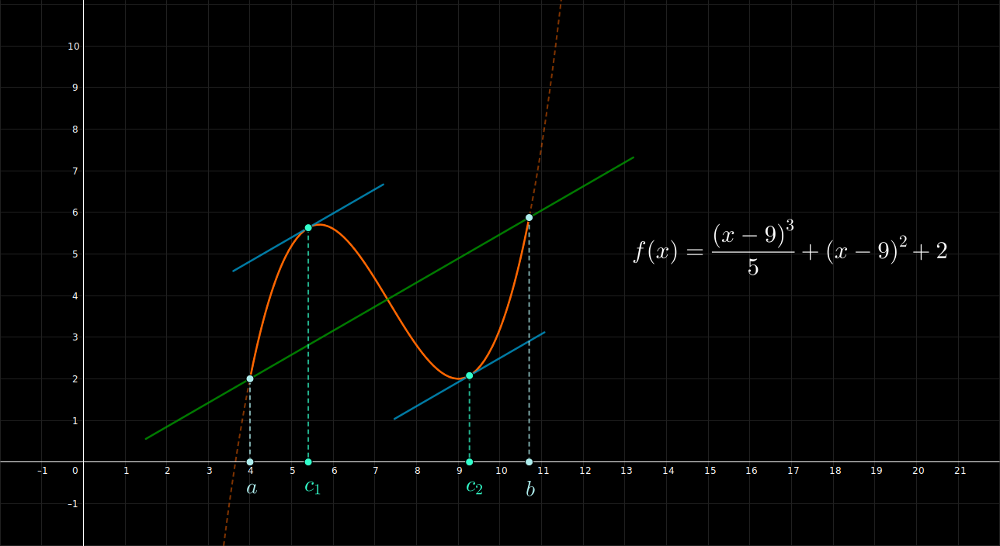

## Teorema de Lagrange - Ejemplo 2

 

$$
    \large{
        f(x) = \frac{(x-9)^{3}}{5} + (x-9)^{2} + 2
    }
    \hspace{1em}
    \in [4, 10.7]
$$

 

 

#### Links

- [Youtube](https://www.youtube.com/watch?v=Z2jbjdW3jvE)
- [Geogebra](https://www.geogebra.org/calculator/ugtk3ewb)