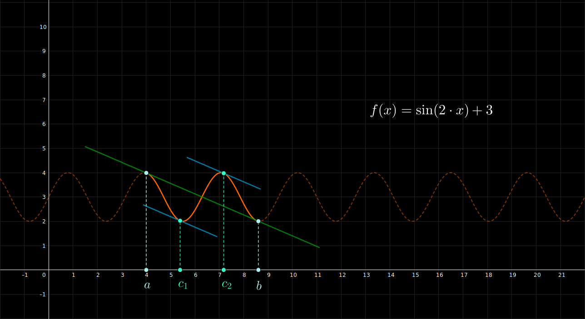

## Teorema de Lagrange - Ejemplo 3

 

$$
    \large{
        f(x) = \sin(2 \cdot x) + 3
    }
    \hspace{1em}
    \in [4, 8.6]
$$

 

 

#### Links

- [Youtube](https://www.youtube.com/watch?v=00i9xzjLibU)
- [Geogebra](https://www.geogebra.org/calculator/yjqvafsa)