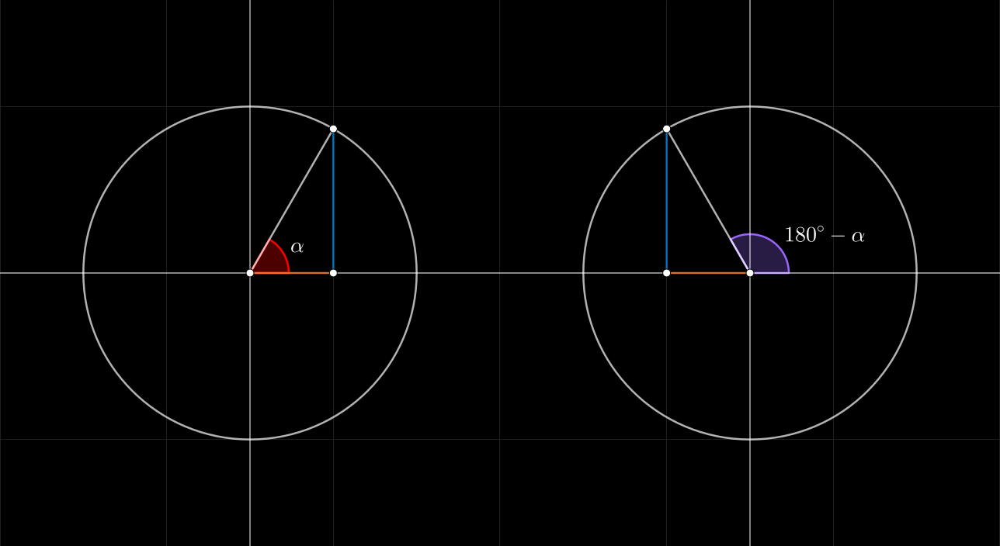

## Seno, Coseno, Tangente de 180 mas / menos alpha

#### Seno de 180 + alpha
$$
\begin{array}{cc}
    \sin(180^{\circ} + \alpha) = -\sin(\alpha)
    &&
    \sin(\pi + \alpha) = -\sin(\alpha)
    \\\\
    \sin(180^{\circ} - \alpha) = +\sin(\alpha)
    &&
    \sin(\pi - \alpha) = +\sin(\alpha)
\end{array}
$$
 

#### Coseno de 180 + alpha
$$
\begin{array}{cc}
    \cos(180^{\circ} \pm \alpha) = -\cos(\alpha)
    &&
    \cos(\pi \pm \alpha) = -\cos(\alpha)
\end{array}
$$
 

#### Tangente de 180 + alpha
$$
\begin{array}{cc}
    \tan(180^{\circ} + \alpha) = \tan(\alpha)
    &&
    \tan(\pi + \alpha ) = \tan(\alpha)
    \\\\
    \tan(180^{\circ} - \alpha) = -\tan(\alpha)
    &&
    \tan(\pi - \alpha ) = -\tan(\alpha)
\end{array}
$$
 

 

#### Links

- [Youtube](https://www.youtube.com/watch?v=4g7NvPcT5B0)
- [Geogebra](https://www.geogebra.org/calculator/hvra6aec)