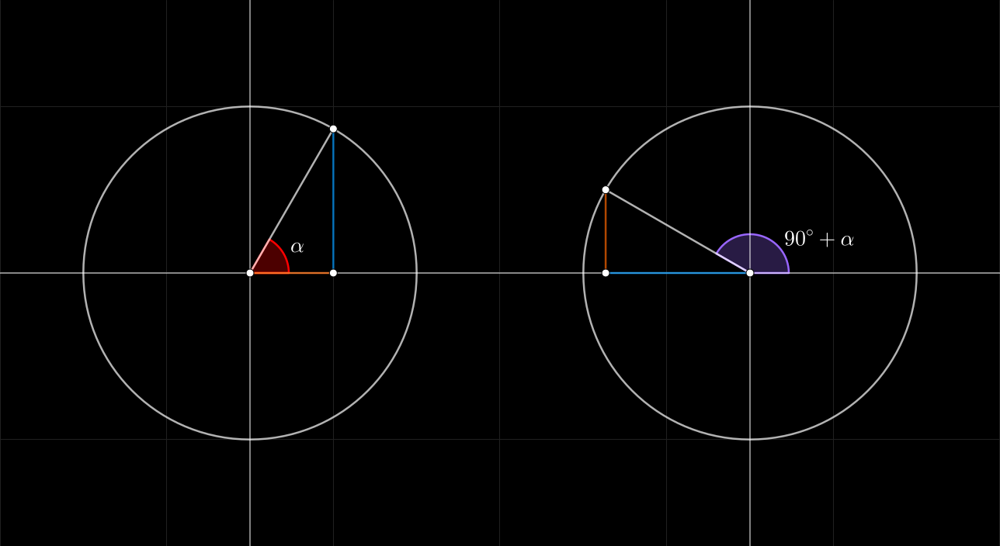
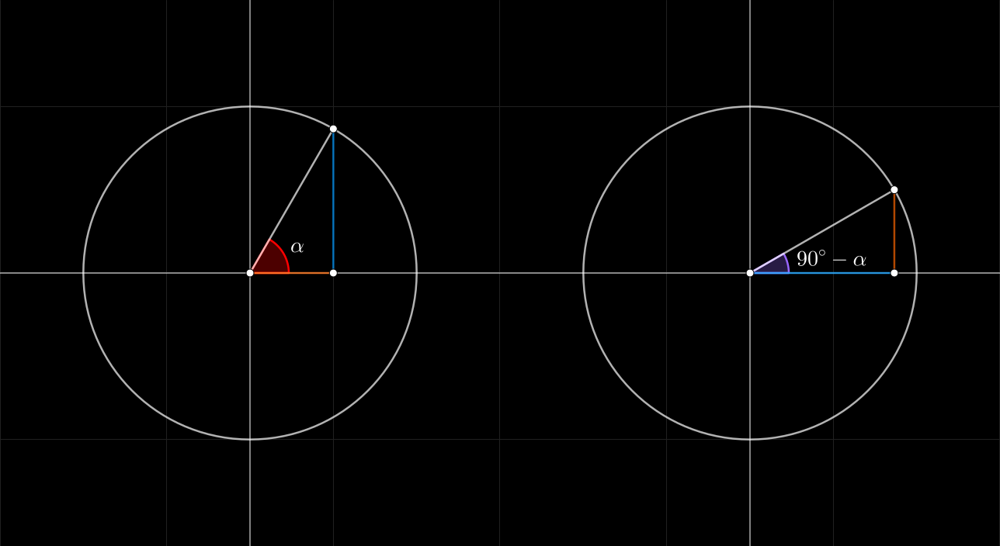

## Seno, Coseno, Tangente de 90 mas / menos alpha

#### Seno de 90 + alpha
$$
\begin{array}{cc}
    \sin(90^{\circ} \pm \alpha) = \cos(\alpha)
    &&
    \sin\left(\dfrac{\pi}{2} \pm \alpha \right) = \cos(\alpha)
\end{array}
$$
 

#### Coseno de 90 + alpha
$$
\begin{array}{cc}
    \cos(90^{\circ} + \alpha) = -\sin(\alpha)
    &&
    \cos\left(\dfrac{\pi}{2} + \alpha \right) = -\sin(\alpha)
    \\\\
    \cos(90^{\circ} - \alpha) = \sin(\alpha)
    &&
    \cos\left(\dfrac{\pi}{2} - \alpha \right) = \sin(\alpha)
\end{array}
$$
 

#### Tangente de 90 + alpha
$$
\begin{array}{cc}
    \tan(90^{\circ} + \alpha) = -\dfrac{1}{\tan(\alpha)}
    &&
    \tan\left(\dfrac{\pi}{2} + \alpha \right) = -\dfrac{1}{\tan(\alpha)}
    \\\\
    \tan(90^{\circ} - \alpha) = \dfrac{1}{\tan(\alpha)}
    &&
    \tan\left(\dfrac{\pi}{2} - \alpha \right) = \dfrac{1}{\tan(\alpha)}
\end{array}
$$
 

 

#### Links

- [Youtube](https://www.youtube.com/watch?v=epNdfoju518)
- [Geogebra](https://www.geogebra.org/calculator/mwwpptbs)