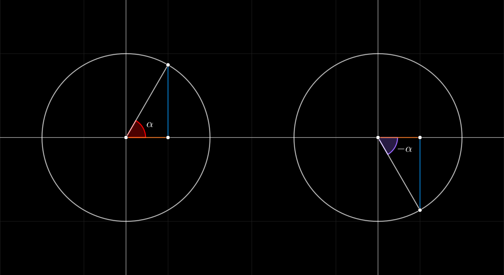

## Seno, Coseno, Tangente de menos alpha

$$
\begin{array}{c}
    \sin(-\alpha) = -\sin(\alpha)
    \\\\
    \cos(-\alpha) = \cos(\alpha)
    \\\\
    \tan(-\alpha) = -\tan(\alpha)
\end{array}
$$
 

#### Links

- [Youtube](https://www.youtube.com/watch?v=ls3fJKQS8vk)
- [Geogebra](https://www.geogebra.org/calculator/vpyzrn8w)